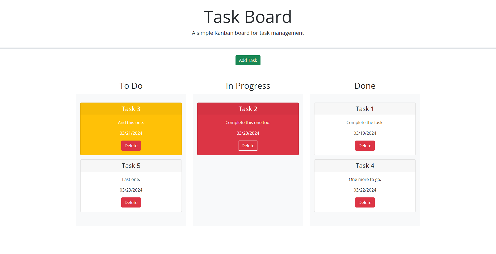

# Task Board

## Link & Contents
- [The Deployed Page](https://jiske-n.github.io/task-board/)
- [Further Goals](#further-goals)
- [Potential Issues/Improvements](#potential-issuesimprovements)
- [Key Learnings](#key-learnings)
- [Contributing and Feedback](#contributing-and-feedback)
- [Credits](#credits)
- [Licence](#licence)

## The Task Board

This page was designed for a user to be able to input individual project tasks and be able to see three rows indicating task status. The user is then able to manipulate the tasks by moving them between rows/statuses. Other features include:
- Saving the tasks to local storage.
- Colour theming for different tasks depending on their status and when they are due.
- The ability to remove or delete tasks.

Goals included, shaping my code to perform all the functionality required whilst writing it only in the provided in the starter code functions, incorporating dayjs, jquery, jqueryui and bootstrap in the project.

- [The Deployed Page](https://jiske-n.github.io/task-board/)

## Further Goals

Other goals include:
-Writing a good README.
-Ensuring commenting is folowing best practices and in place for ease of future alteration.
-Have all elements of the page working without errors.

## Potential Issues/Improvements

- Condensing some of the code. For example replacing the section converting the first letter to capitalise with a function achieving the same.
- More consistent use of just jquery/ui.
- Unsure if the balance for commenting is about right or too sparse/many.
- Trying to convert code to be uniform and follow best practice.

## Key Learnings

The biggest learning points and hurdles I faced revolved around working out how different elements linked together.

Other learnings include:
- Jquery syntax.
- Triggering artificial 'click' events.
- Hopefully, improved commenting.
- Generating unique numbers/ids.

## Contributing and Feedback

If you find any issues or have contributions or feedback you can do so by opening an [issue](https://github.com/Jiske-N/task-board/issues) on Github.

## Credits

Starter code provided by edX/Monash University.

Many function contents were copied and ammended to fit from the solved week 5 mini project.

Also made use of the Xpert learning assistant, AskBcs and my instructor with troubleshooting issues.

## Licence

None presently. 
